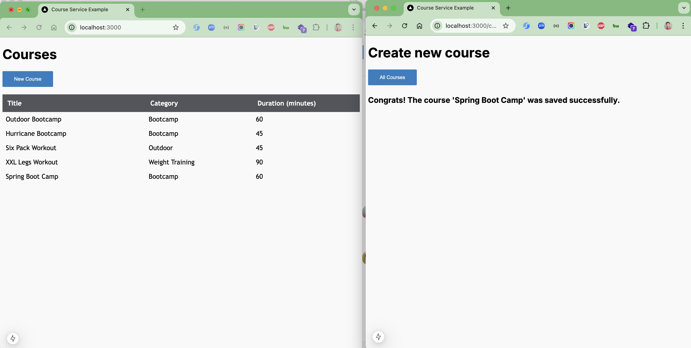

# course-web

### Things to do list:

1. Clone the repository by running the following command in your terminal:
   `git clone https://github.com/hendisantika/course-web.git`
2. Go to the project folder by running the following command: `cd course-web`
3. Run the project by running the following command: `mvn clean spring-boot:run`
4. Go to frontend folder by running the following command: `cd frontend`
5. Run the frontend by running the following command: `pnpm install && pnpm start`
6. Open your favorite browser then type `http://localhost:3000`
7. Open your favorite browser then type `http://localhost:8080/h2-console`
8. Enjoy the app!

### Images Screen shot

Home Page

Add New Course

